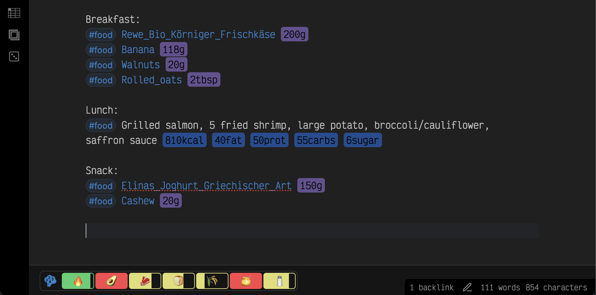

<h1>
  Food Tracker 
</h1>

[](https://github.com/forketyfork/obsidian-food-tracker/actions/workflows/build.yml)
[](https://github.com/forketyfork/obsidian-food-tracker/releases/latest)
[](LICENSE)
[](https://www.typescriptlang.org/)

An Obsidian plugin to track your food intake (calories, macronutrients) and nutritional information with real-time nutrition totals, intelligent food suggestions, and flexible entry methods including both database-driven and inline nutrition tracking.

This plugin works on **mobile** and **desktop**, with layouts that adapt to smaller screens.



## Demo


## Features

### 🍎 Food Database Management

- **Add nutrients**: Create nutrient entries with detailed nutritional information through a convenient modal interface
- **OpenFoodFacts integration**: Search and import nutritional data from the OpenFoodFacts database by product name or barcode
- **Complete nutrition tracking**: Track calories, fats, saturated fats, carbohydrates, sugar, fiber, protein, and sodium
- **Metadata format**: Stores nutritional data in YAML frontmatter for easy querying and analysis, including barcode, brand, and URL for products imported from OpenFoodFacts
- **Configurable storage**: Set a custom directory for storing nutrient files

### 📝 Smart Food Entry

- **Configurable food tag**: Customize the tag used for food entries (default: `#food`, can be changed to `#meal`, `#nutrition`, etc.)
- **Intelligent autocomplete**: Type your food tag followed by a food name for intelligent suggestions from your nutrient database
- **Flexible food formats**: Multiple ways to track your food:
  - **Database entries**: `#food [[food-name]] amount` - uses your nutrient database
  - **Inline nutrition**: `#food Food Name 300kcal 20fat 10prot 30carbs 3sugar` - specify nutrition directly
  - **Multiple units**: Support for various units including g, kg, ml, l, oz, lb, cup, tbsp, tsp, pc
- **Visual highlighting**: Food amounts and nutrition values are highlighted in the editor for easy identification
  - Blue highlighting for calorie intake and nutrition values
  - Red highlighting for calorie burns (workout tag or negative calories)
- **Workout logging**: Track exercise with a dedicated tag (default: `#workout`) or by entering negative calories to subtract
  them from your totals
  - Autocomplete only suggests calorie values for workout entries (no food names or other nutrients)
  - Visual distinction: workout calories are highlighted in red to differentiate from food intake

### 📊 Real-time Nutrition Tracking

- **Automatic daily total**: Real-time calculation of total nutrition from all food entries in the current document
- **Compact visual display**: Clean nutrition bar with emoji indicators and progress bars
- **Interactive tooltips**: Hover over nutrition indicators to see detailed values and goal progress
- **Flexible display modes**: Show nutrition total in status bar or directly in the document
- **Comprehensive metrics**: Track calories, fats, saturated fats, protein, carbohydrates, fiber, sugar, and sodium
- **Smart parsing**: Automatically detects and calculates nutrition from food entries throughout your notes
- **Frontmatter totals**: Nutrition totals are automatically saved to file properties (e.g., `ft-calories`, `ft-protein`) for fast statistics loading and external querying

### 🎯 Nutrition Goals & Progress Tracking

- **Goals file support**: Define daily nutrition goals in a simple text file
- **Visual progress bars**: Real-time progress indicators showing how close you are to your goals
- **Color-coded feedback**: Green (within 10% of goal), yellow (below 90%), red (exceeding goal)
- **Compact nutrition bar**: Bordered container with emoji progress indicators separated by vertical lines
- **Enhanced tooltips**: Detailed hover information shows values and goal completion percentages
- **Flexible goal setting**: Set goals for calories, fats, saturated fats, protein, carbohydrates, fiber, sugar, and sodium

### 📈 Monthly statistics

- **Quick access**: Ribbon button opens a window with a month picker and daily macronutrient table
- **Daily breakdown**: Each row shows the same compact nutrition bar used in the status bar
- **Fast loading**: Statistics are read from frontmatter properties instead of re-parsing entire files
- **Flexible matching**: Daily notes are detected using a configurable filename format (default `YYYY-MM-DD`)

## Installation

### From Obsidian Community Plugins

1. Open Obsidian
2. Go to Settings > Community plugins
3. Disable Safe mode if necessary
4. Click Browse and search for "Food Tracker"
5. Install the plugin
6. Enable the plugin after installation

### Manual Installation

1. Download the latest release from the GitHub repository
2. Extract the ZIP file into your Obsidian vault's `.obsidian/plugins/` folder
3. Enable the plugin in Obsidian settings

## Usage

### Adding Food Items to Your Database

1. Open the command palette (Ctrl/Cmd + P)
2. Search for "Add nutrient" and select the command
3. Fill in the nutrient information in the modal:
   - **Name or barcode** (required)
   - **🔍 Search**: Use the search button to find foods in OpenFoodFacts database
     - Enter a product name to search by text
     - Enter a barcode (8-14 digits) to look up by barcode (EAN-8, UPC-A, EAN-13, ITF-14)
   - **Nutritional values per 100g**:
     - Calories
     - Fats (in grams)
     - Carbohydrates, sugar, fiber (in grams)
     - Protein (in grams)
     - Sodium (in milligrams)
   - _Optional_: **Serving size** to specify typical weight of one piece (in grams)
4. Click "Create" to save the nutrient file

### Tracking Food Intake

#### Method 1: Using Your Food Database

1. In any note, type your food tag (default: `#food`) followed by a space
2. Start typing a food name - autocomplete suggestions will appear from your database
3. Select a food item and add the amount with unit:
   ```
   #food [[apple]] 150g
   #food [[chicken-breast]] 200g
   #food [[oats]] 50g
   ```

#### Method 2: Inline Nutrition Entry

For quick tracking without creating database entries, specify nutrition values directly:

```
#food Breakfast sandwich 250kcal 15fat 12prot 20carbs
#food Protein shake 180kcal 8fat 25prot 5carbs 2sugar
#food Mixed nuts snack 200kcal 18fat 6prot 8carbs
```

**Supported nutrition keywords:**

- `kcal` - calories
- `fat` - fats in grams
- `satfat` - saturated fats in grams
- `prot` - protein in grams
- `carbs` - carbohydrates in grams
- `sugar` - sugar in grams
- `fiber` - fiber in grams (database entries only)
- `sodium` - sodium in milligrams (database entries only)

#### Method 3: Mixed Approach

You can combine both methods in the same document:

```
#food [[oatmeal]] 50g
#food Quick protein bar 200kcal 8fat 15prot 20carbs
#food [[banana]] 1pc
```

The nutrition total will automatically update as you add food entries using any method.

### Logging Workouts

Deduct workout calories from your daily totals in two ways:

- Use the dedicated workout tag (default: `#workout`):

  ```
  #workout Morning run 230kcal
  #workout Strength training 180kcal
  ```

  When you type `#workout` followed by a description and start typing numbers, autocomplete will suggest only calorie values (e.g., `300kcal`). Food names and other nutrition keywords are not available with the workout tag.

  **Important:** Workout tags only accept positive calorie values. Negative values (e.g., `#workout running -200kcal`) are invalid and will be ignored in calculations and not highlighted. This ensures clear semantics: workout entries always represent calories burned.

- Enter negative calories directly with your food tag for ad-hoc workout tracking:

  ```
  #food Evening yoga -120kcal
  ```

In both cases, the plugin subtracts the logged calories (and any other specified nutrients) from your daily totals. Calories logged with the workout tag or as negative values are **highlighted in red** in the editor to visually distinguish calorie burns from calorie intake (which is highlighted in blue).

**Calorie floor:** Your total calorie count is always floored at 0. If your workout calories exceed your food intake, the plugin displays 0 kcal instead of a negative value, ensuring totals never go below zero.

### Setting Up Nutrition Goals

1. Create a goals file in your vault (e.g., `nutrition-goals.md`)
2. Define your daily nutrition goals using the following format:
   ```
   calories: 2000
   fats: 70
   protein: 120
   carbs: 250
   fiber: 25
   sugar: 50
   sodium: 2300
   ```
3. Configure the goals file path in plugin settings
4. Your nutrition totals will now display as a compact nutrition bar with emoji progress indicators

The nutrition bar displays as a bordered container with:

- **Emoji indicators**: Each nutrient represented by an emoji (🔥 calories, 🥑 fats, 🥩 protein, etc.)
- **Progress bars**: Visual progress indication within each emoji indicator
- **Vertical separators**: Clean lines between each nutrient for clarity
- **Interactive tooltips**: Hover over any emoji to see detailed values and goal completion percentages

The progress bars use color coding:

- **Green**: You're within 10% of your goal (90-110%)
- **Yellow**: You're below 90% of your goal
- **Red**: You've exceeded your goal (over 110%)

### Configuration

Go to Settings > Food Tracker to configure:

- **Nutrient directory**: Choose where nutrient files are stored (default: "nutrients"). The setting now offers type-ahead folder suggestions.
- **Nutrition total display**: Choose to show the total in the status bar or directly in the document
- **Food tag**: Customize the tag used for food entries (default: "food" for `#food`, can be changed to "meal" for `#meal`, "nutrition" for `#nutrition`, etc.)
- **Workout tag**: Customize the tag used for workout entries (default: "workout" for `#workout`)
- **Daily note filename format**: Specify the Moment.js-style pattern used to find daily notes (default: `YYYY-MM-DD`). Supports tokens like `dddd` or literal text (e.g., `YYYY-MM-DD-[journal]`). The preview shows how today's note would be named.
- **Daily note format examples**:
  - `YYYY.MM.DD` → `2025.11.12`
  - `YYYY-MM-DD-[journal]` → `2025-11-12-journal`
  - `dddd YYYY-MM-DD` → `Wednesday 2025-11-12`
- **Goals file**: Specify the path to your nutrition goals file (e.g., "nutrition-goals.md"). The field includes type-ahead file suggestions.
- **Metadata field names**: Customize the frontmatter property names used for storing nutrition totals in daily notes. By default, the plugin uses `ft-` prefixed names (e.g., `ft-calories`, `ft-protein`). You can customize these to match your existing setup or personal preferences (e.g., just `calories` instead of `ft-calories`).

> **Note**: When you change the food or workout tag settings, the plugin will only recognize the new tags. Existing entries will need to be updated if you want them included in calculations.

## Requirements

- Obsidian v0.15.0 or higher

## Development

Run the development build with change watch:

```shell
yarn dev:watch
```

Run the TypeScript type check:

```shell
yarn typecheck
```

Run the linter:

```shell
yarn lint
```

Run the tests:

```shell
yarn test
```

Run the tests in watch mode:

```shell
yarn test:watch
```

Generate a coverage report:

```shell
yarn coverage
```

Format the code:

```shell
yarn format
```

Build CSS from source:

```shell
yarn build:css
```

Run the production build (includes tests, type checking, and formatting):

```shell
yarn build
```

Bump the version in `package.json` and `manifest.json`:

```shell
yarn version --immediate <strategy|version>
```

Full release process (version bump, push, and tag):

```shell
yarn release -- <strategy|version>
```

## My other plugins

- [YouTrack Fetcher](https://github.com/forketyfork/obsidian-youtrack-fetcher): Fetch YouTrack issues into structured notes with templates.
- [Grazie Plugin](https://github.com/forketyfork/obsidian-grazie-plugin): Grammar and spell checking powered by JetBrains AI Platform (in development).
- [Speech Bubbles](https://github.com/forketyfork/obsidian-speech-bubbles): Render transcript notes as chat-style speech bubbles.

## License

This plugin is licensed under the MIT License.
